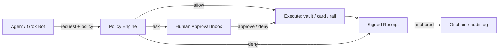

<div align="center">
  
  <h1>AskGrokWallet</h1>
  <p><strong>A governed wallet for Grok agents.</strong><br>Small things run. Big things ask. Everything receipts.</p>
  <p><strong>Implements ERC-8196 (AI Agent Authenticated Wallet)</strong> — deployed on Base mainnet.</p>
  <p><em>agents run · humans rule · proof settles</em></p>
  <p>
    <a href="https://img.shields.io/badge/license-MIT-4f46e5"></a>
    <a href="https://img.shields.io/badge/version-0.1.0-38bdf8"></a>
    <a href="https://img.shields.io/badge/status-experimental-f59e0b"></a>
    <a href="https://img.shields.io/badge/for-Grok%20Bot-000000"></a>
    <a href="https://img.shields.io/badge/PRs-welcome-10b981"></a>
    <a href="https://github.com/richard7463/askgrokwallet/actions/workflows/ci.yml"></a>
    <a href="https://github.com/richard7463/askgrokwallet/actions/workflows/codeql.yml"></a>
    <a href="https://skills.sh/richard7463/askgrokwallet"></a>
  </p>
</div>

AI agents can think, trade, and pay. AskGrokWallet is the layer that decides what they are **allowed** to do — inside human-defined rules, with a verifiable receipt for every outcome.

```text
agent request -> policy (allow / ask / deny) -> execute or approve -> signed receipt
```

> **Live:** [AskGrokWallet site](https://askgrokwallet.io/pitch.html) · [interactive demo](https://askgrokwallet.io/demo) · [approval inbox](https://askgrokwallet.io/approvals) ·
> **xAI marketplace PR:** [plugin-marketplace#341](https://github.com/xai-org/plugin-marketplace/pull/341)

---

## Live onchain (Base mainnet)

The governed-wallet contracts are deployed on **Base mainnet** (chainId 8453).
Source-verification on BaseScan is in progress; until then, the canonical source
is this repo's [`contracts/`](contracts/) directory (Hardhat project, CI runs
the 19-test suite on every push):

| Contract | Address | Explorer |
| --- | --- | --- |
| TrustLeaseController (ERC-8196) | `0x4ACcB1df8cc625AC05743888158CC3B866aC9833` | [BaseScan](https://basescan.org/address/0x4ACcB1df8cc625AC05743888158CC3B866aC9833) |
| BoundlessVault | `0xd9526Eb615f5e252341b5a83b3c26eCca4f1284e` | [BaseScan](https://basescan.org/address/0xd9526Eb615f5e252341b5a83b3c26eCca4f1284e) |
| VerificationScoreRegistry (ERC-8126) | `0x89c8B3d053a79A0bd5A47597aaF97729f504d359` | [BaseScan](https://basescan.org/address/0x89c8B3d053a79A0bd5A47597aaF97729f504d359) |
| Mock USDC (demo) | `0x17058C78CFE90314dd349C7fAC71Bb4f0A8f0852` | [BaseScan](https://basescan.org/address/0x17058C78CFE90314dd349C7fAC71Bb4f0A8f0852) |

Deployment record: [`contracts/deployments/base-mainnet.json`](contracts/deployments/base-mainnet.json).

## Feedback (we read everything)

This is experimental infrastructure. If you build with it, review it, or audit
it, open a **[Developer feedback](https://github.com/richard7463/askgrokwallet/issues/new?template=feedback.yml)**
issue — install friction, policy/API design, ERC-8196 interface notes, security
concerns. Hard criticism lands faster than praise.

## Choose your mode

AskGrokWallet protects money at **different trust boundaries**. Pick the mode
that matches how the agent holds its wallet — and never claim more than the
mode delivers:

| Mode | Who holds the keys | What AskGrokWallet enforces | Try it |
| --- | --- | --- | --- |
| `advisory` | The agent (EOA, keys local) | Policy advice + signed receipts only. It **cannot** stop a direct chain signature — that is impossible for any third party with an EOA. | Current hosted demo flow |
| `guarded` | BoundlessVault contract | Everything onchain: policy, budget, drawdown, allowlist. Out-of-rule actions **revert** before funds move. Agent has no naked key. | Sepolia-verified rail (below) |
| `watchdog` | The agent, on its host | A signing gate: `sendTransaction` first asks AskGrokWallet — `allow` signs, `ask` waits for a human, `deny` never signs. | `guarded-signer/` package |

`advisory` and `watchdog` can be combined with `guarded` (host gate + vault
gate). A watchdog still cannot stop the agent from exfiltrating a raw private
key — key hygiene is a separate layer.

### Action rules (consequential actions)

Beyond amounts, the policy engine gates **action types**. Canonical phrasing:

```text
Ask me before cancel, downgrade, delete, or send.
Never cancel without asking.
Only allow payments to known billers.
```

Send the request with the matching `intentKind`:

```text
transfer · purchase · billPay · refund · trade ·
cancel · downgrade · upgrade · delete · send · apply · update
```

Evaluation order is fixed: deny → ask → allow → default. Consequential kinds
(cancel/downgrade/upgrade/delete/send/apply/update) with **no** explicit rule
default to `ask` (fail-safe). Payment kinds still fall through to amount
rules. Tested live: `intentKind: "downgrade"` → ask ("action type downgrade
requires human approval"), `intentKind: "cancel"` under "never cancel" → deny.

After a human approves a consequential action, the API returns an
**agent-steps** plan (contact the provider, confirm, record) for the host
agent to execute — AskGrokWallet does not pretend the action completed on its
own. Onchain-capable kinds (transfer) have no agent steps; they go through
the guarded executor.

### Tested (2026-09-03)

- `advisory`: policy allow/ask/deny + receipts verified against the live host
  (auth 401/201, Ed25519 receipt verification `{"verified":true}`).
- `guarded`: real Ethereum Sepolia execution, **hosted end-to-end** — approve
  an `execute` intent on askgrokwallet.io → Jakarta settlement worker → vault
  transfer (tx `0xefea03f8…4771`, plus earlier `0xbf5a6f…dfee` /
  `0x763cea…0b0b`) → receipt `verified:true`.
- `watchdog`: `guarded-signer` unit tests (allow signs / ask waits with id /
  deny never signs / execute-after-approve) — 4/4 passing. A real Grok-host
  install is not verifiable from this repository.

## Why

Giving an agent a wallet is easy. Giving it a wallet with **rules** is not.

- Phantom, Stripe Link, Circle, and Kraken all give agents money — none of them decide what the agent may *do* with it.
- Ramp has an approval dashboard, but only inside Ramp's own card ecosystem.
- AskGrokWallet is the **cross-rail governance layer**: one plain-English policy, one approval inbox, one receipt format — in front of any wallet, any agent.

## Features

| # | Feature | What you get |
| --- | --- | --- |
| 01 | **Policy engine** | `payments under $50 run automatically; over $50 ask me; never pay blacklisted merchants; daily budget $200` → compiled `allow / ask / deny` rules |
| 02 | **Approval inbox** | Requests that need a human land in one inbox with full context; approve / deny in one tap |
| 03 | **Signed receipts** | Who, which agent, what, how much, who approved, when — every outcome leaves a receipt |
| 04 | **Budgets & allowlists** | Per-agent per-tx limits, daily budgets, counterparty allowlists, action allowlists |
| 05 | **Any rail** | Stripe Link, Ramp, Phantom, Circle USDC, Kraken, or the Boundless vault — same rules, swap rails freely |
| 06 | **Any agent** | Grok Bot, Cursor, Claude, Grok Build — one panel manages a whole roster |
| 07 | **Vault engine** | Funds locked in an onchain vault; leases grant bounded authority; the contract hard-blocks over-budget requests |
| 08 | **x402 ready** | Crypto rail support for conditional payments ("AI pays for itself", never silently) |

## Standards alignment

The onchain rail implements [ERC-8196 — AI Agent Authenticated Wallet](https://eips.ethereum.org/EIPS/eip-8196)
(Ethereum Final standard) as a dedicated policy execution module:

- **`IAIAgentAuthenticatedWallet`** — `registerPolicy` / `executeAction` / `revokePolicy` / `getPolicy`, with the standard's events and error codes
- **EIP-712 `AgentAction` signatures** — the agent signs every action, bound to its `policyHash`; the owner's private key never leaves the owner
- **Hash-chained audit trail** — every signed action and every settled receipt links to the previous entry; `verifyAuditChain` detects any tampering
- **ERC-8126 risk gate** — a `VerificationScoreRegistry` accepts EIP-712 signed attestations from the verification provider; execution rejects agents whose current risk score exceeds the policy's `minVerificationScore`
- **Entropy commit-reveal** — action signatures carry an entropy commitment, with onchain reveal verification
- **Active containment** — revoke a policy or pause the operator; authority dies instantly

ERC-8196 answers "is this action authorized right now?". AskGrokWallet adds the
human-in-the-loop middle ground the standard leaves open — *small things run,
big things ask* — and every approval or denial is itself signed and anchored
into the same tamper-evident chain.

## Quickstart — use AskGrokWallet from a Grok Bot

> Every request in this guide was executed against the live host
> (https://askgrokwallet.io) on 2026-09-03. Response shapes below are real,
> abbreviated only for readability.

### 0. Install the plugin (on your Grok host)

```bash
grok plugin install richard7463/askgrokwallet --trust
```

After install the `askgrokwallet` skill appears in `/skills`; enable it for a
Bot via Settings → Plugins. Two honest caveats:

- `grok plugin install` runs on a Grok host, so this repository cannot execute
  it for you. The xAI in-app marketplace listing is [PR #341](https://github.com/xai-org/plugin-marketplace/pull/341) — until it merges, use the command above.
- The hosted API is a **sandbox**: its store is ephemeral and there is no
  execution rail yet (see [Boundaries](#boundaries-read-before-real-money)).

### 1. Write a policy in plain English

The engine compiles sentences into rules: `autoBelowUsd`, `askAboveUsd`,
`dailyBudgetUsd`, `maxDrawdownUsd`, `maxDailyLossUsd`, `denyKeywords`,
`allowKeywords`.

```text
# Payments
payments under $50 run automatically; over $50 ask me;
never pay blacklisted merchants; daily budget $200

# Trading (see examples/policy-trading.txt)
trades under $10 run automatically; over $10 ask me;
max drawdown $50; daily loss limit $20; never trade pump-dump tokens
```

### 2. Evaluate every money move

Send the action to the policy engine before you execute anything:

```bash
curl -s https://askgrokwallet.io/api/approvals \
  -H 'Content-Type: application/json' \
  -d '{
    "source": "demo",
    "requester": "my-trading-bot",
    "summary": "swap 5 USDC for ETH",
    "amountUsd": 5,
    "target": "uniswap",
    "policyText": "trades under $10 run automatically; over $10 ask me; max drawdown $50; daily loss limit $20; never trade pump-dump tokens",
    "drawdownUsd": 3,
    "lossTodayUsd": 1
  }'
```

The three verdicts, all tested live:

| Situation | Observed result |
| --- | --- |
| $5 swap, no risk breach | `allow` → auto-allowed receipt, Ed25519 v2 signature |
| $25 swap (over the $10 line) | `ask` → pending approval created (`id` returned) |
| $5 swap but drawdown $60 ≥ $50 | `ask` → reason: "auto-trading paused" |
| Buying a pump-dump token | `deny` → denied receipt with reason |

`source: "demo"` is the keyless demo identity. Any other `source` requires a
bearer token:

```bash
curl -s https://askgrokwallet.io/api/approvals \
  -H 'Content-Type: application/json' \
  -H 'Authorization: Bearer YOUR_TOKEN' \
  -d '{ ... "source": "grok", ... }'
```

Unauthenticated non-demo writes are rejected with `401` (tested).

### 3. Decide from the approval inbox

An `ask` request lands in the inbox at https://askgrokwallet.io/approvals
(and in `GET /api/approvals?status=pending`). Approve or deny by id:

```bash
curl -s -X POST https://askgrokwallet.io/api/approvals/APPROVAL_ID \
  -H 'Content-Type: application/json' \
  -d '{ "decision": "approve", "by": "operator@demo" }'
```

The receipt comes back `status: "approved"` with an Ed25519 signature.

### 4. Verify any receipt — no shared secret

Receipts are signed with Ed25519. Anyone can verify a receipt row against the
published public key:

```bash
curl -s https://askgrokwallet.io/api/receipt-public-key
# { "alg": "ED25519", "publicKey": "MCow..." }

curl -s -X POST https://askgrokwallet.io/api/receipts/verify \
  -H 'Content-Type: application/json' \
  -d 'PASTE_THE_RECEIPT_JSON_HERE'
# { "verified": true }
```

Changing the amount, target, verdict, or decision after signing flips the
result to `false`.

### Boundaries (read before real money)

- **Persistent store**: the hosted backend now stores approvals in Postgres on
  the Jakarta server (not ephemeral). Demo rows persist.
- **Two execution layers — keep them straight**:
  - Onchain guarded execution **works and is verified on a real testnet**
    (Ethereum Sepolia, 2026-09-03): lease + operator + budget checks pass,
    then BoundlessVault executes a guarded transfer and anchors the receipt
    onchain (execution tx `0xbaf2c3…58e3`, anchor `0x1bd82e…628e`).
  - The hosted approval inbox **auto-triggers** the executor: an approved
    request with an `execute` intent is settled by the Jakarta worker on
    Ethereum Sepolia (e2e tx `0xefea03f8…4771`, receipt `verified:true`).
    Mainnet guarded execution still needs a funded mainnet vault.
- **Risk oracle**: the ERC-8126 gate currently uses a mock provider; wiring the
  real oracle (erc8126scan) is in progress.
- **BaseScan verification**: contracts are deployed on Base mainnet; source
  verification on BaseScan is pending (canonical source is `contracts/` here).

## API reference

| Purpose | Method + URL |
| --- | --- |
| Compile + evaluate policy | `POST https://askgrokwallet.io/api/approvals` (with `policyText`) |
| Create approval request | `POST https://askgrokwallet.io/api/approvals` |
| List approvals | `GET https://askgrokwallet.io/api/approvals?status=pending` |
| Decide approval | `POST https://askgrokwallet.io/api/approvals/{id}` |
| Approval inbox (UI) | `GET https://askgrokwallet.io/approvals` |
| Public receipt key | `GET https://askgrokwallet.io/api/receipt-public-key` |
| Verify a receipt | `POST https://askgrokwallet.io/api/receipts/verify` |

Write endpoints require `Authorization: Bearer <token>` unless the body uses
`"source": "demo"` (the keyless demo identity). The hosted demo enforces this
with `401` responses (tested 2026-09-03).

## Architecture



The policy engine compiles plain-English rules into a structured policy (`autoBelowUsd`, `askAboveUsd`, `dailyBudgetUsd`, `denyKeywords`, `allowKeywords`). The approval store is pluggable: local file for development, KV for hosted deployments.

## Security

- The plugin **never** asks for private keys, passwords, or credentials
- Policy, budgets, and allowlists are always operator-defined; the skill never invents them
- Blocked actions return a reason and are **never** executed
- Receipts record who, what, how much, verdict, decision, and timestamps
- Marketplace packaging contains no `curl | bash`, remote code download/exec, or credential exfiltration patterns

See [SECURITY.md](SECURITY.md) for the vulnerability disclosure policy.

## Status & roadmap

- ✅ Policy engine + approval inbox + receipts — tested end-to-end (local + hosted)
- ✅ Boundless vault: lease, budgets, real transfers, onchain receipts — verified on a local chain, deployed to Base mainnet
- ✅ Guarded onchain execution verified on Ethereum Sepolia (testnet, 2026-09-03) — operator-script rail + **hosted approve→execute auto-trigger (Jakarta worker)**
- ✅ Marketplace packaging for Grok Build + Cursor
- ✅ Deployed to Base mainnet (TrustLeaseController / BoundlessVault / VerificationScoreRegistry)
- ✅ Hosted persistent storage (Postgres 15 on the Jakarta server)
- ⏳ BaseScan source verification
- ⏳ x402 payment rail
- ✅ Approval inbox → onchain executor auto-trigger (live on Sepolia; mainnet pending vault funding)

## Contributing

See [CONTRIBUTING.md](CONTRIBUTING.md). One logical change per PR, keep the
diff minimal, no secrets. All community spaces follow the
[Code of Conduct](CODE_OF_CONDUCT.md).

## License

MIT © 2026 AskGrokWallet
