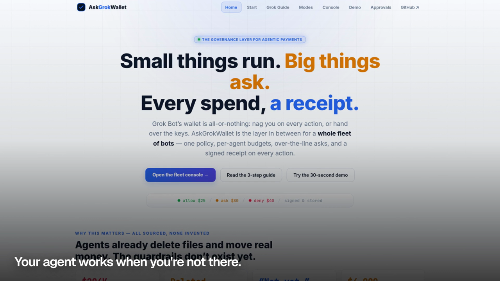
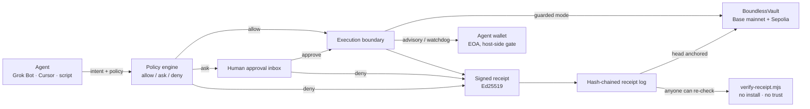
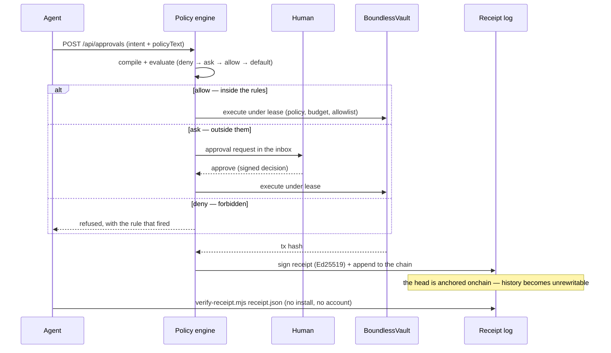

<div align="center">
  
  <h1>AskGrokWallet</h1>
  <p><strong>The rules-and-receipts layer for AI agents that spend money.</strong></p>
  <p>Small things run · big things ask · everything leaves a receipt</p>
  <p>
    <a href="LICENSE"></a>
    <a href="https://askgrokwallet.io"></a>
    <a href="#deployed-and-verified-contracts"></a>
    <a href="contracts/docs/erc8196-alignment.md"></a>
    
    
    
  </p>
</div>

> **Unaudited developer preview.** The guarded end-to-end path has been exercised
> on Ethereum Sepolia with mock assets. Contracts are deployed on Base mainnet,
> but no mainnet-value settlement has been demonstrated. Do not use this project
> to protect production funds yet.

Giving an agent a wallet is easy. Giving it a wallet with **rules** is not.

```text
agent request → policy (allow / ask / deny) → execute, or a human decides → signed receipt → anchored log
```

AskGrokWallet sits between the agent and the money. Three things are load-bearing,
and each one is checkable from outside this repository:

1. **The policy is enforced, not suggested.** In `guarded` mode the agent's funds live
   in a vault and an out-of-policy action **reverts at the contract**, before any value
   moves. The bound is a revert, not a setting.
2. **A human is in the loop for exactly the actions that need one.** "Payments under
   $50 run, over $50 ask me" compiles to `allow / ask / deny`; only the `ask` cases
   reach the approval inbox.
3. **Every outcome leaves a receipt a stranger can verify** — four lines from one
   dependency-free file: the signature over every field that matters (including where
   the money went), the receipt's fixed position in an append-only hash-chained log,
   and the log head anchored in a blockchain transaction. No account, no trust in us.

**Watch it work (30s):** [walkthrough video](https://askgrokwallet.io/askgrokwallet-demo.mp4) ·
**Try it:** [interactive demo](https://askgrokwallet.io/demo) ·
[approval inbox](https://askgrokwallet.io/approvals) ·
**Live site:** [askgrokwallet.io](https://askgrokwallet.io)

---

## For Judges — Runtime NYC, 19 September 2026

| What | Where |
| --- | --- |
| Live product | https://askgrokwallet.io |
| 30-second demo (video) | [askgrokwallet.io/askgrokwallet-demo.mp4](https://askgrokwallet.io/askgrokwallet-demo.mp4) · also committed at [`assets/askgrokwallet-demo.mp4`](assets/askgrokwallet-demo.mp4) |
| Interactive demo + approval inbox | [/demo](https://askgrokwallet.io/demo) · [/approvals](https://askgrokwallet.io/approvals) |
| Public receipt log (live JSON) | https://askgrokwallet.io/api/receipts/chain |
| Receipt verifier — one file, zero dependencies | [release `verify-receipt-v1.0.0`](https://github.com/richard7463/askgrokwallet/releases/tag/verify-receipt-v1.0.0) · sha256 `ba066e7cdb19a0b9a5efb1eed6ba62d2440c9a5aeaee2d60caba12707acecf73` |
| Onchain proof | [transactions and blocks](#live-proof--checked-2026-09-18) · [deployed contracts](#deployed-and-verified-contracts) |
| Tests you can run in three minutes | 20 contract tests · 10 verifier behaviour assertions · plugin package smoke test — see [Local run](#local-run) |
| Track entered | **Bankr grand prize** — agentic commerce / autonomous financial agents |
| Repository map | [below](#repository-map) |

### Judging scorecard

Bankr judges in this order: **Product**, **Founder-Market-Fit**, **Execution**.

| Criterion | Our answer | Open this to check |
| --- | --- | --- |
| **Product** — useful, compelling, something people would want | Agents already move money (Grok Bot, Cursor, scripts). The two things their operators cannot get today are a **bound** the agent cannot talk its way past and a **record** a third party will accept. This is both, in one loop: policy → human when needed → execution → receipt. | [30s video](https://askgrokwallet.io/askgrokwallet-demo.mp4) · [live demo](https://askgrokwallet.io/demo) · [three modes](#three-modes--pick-by-where-the-keys-live) |
| **Founder-Market-Fit** — disrupting something in the current stack | The stack splits the problem: wallets (MetaMask Guard Mode, Coinbase CDP, Turnkey) hold funds; card rails (Stripe Link) approve per purchase; provider dashboards log what their own service did. None of them hands the operator an enforceable bound *plus* a receipt that survives being shown to someone who does not trust the operator. | [What makes this different](#what-makes-this-different) |
| **Execution** — how much actually works | Live product; contracts deployed on Base mainnet and exercised end-to-end on Sepolia with real transfers and anchored receipts; 20 contract tests; a versioned standalone verifier with an offline behaviour test; an outside reviewer broke that verifier, and the fix shipped as a pinned release with their repro kept as a test. | [Live proof](#live-proof--checked-2026-09-18) · [Outside review](#outside-review-kept-as-a-test) |

---

## Live proof — checked 2026-09-18

Every number and address below was read from the chain or from the live service on
2026-09-18. Open the explorers and check them.

### Guarded execution, end to end (Ethereum Sepolia, chainId 11155111)

One round, in order: the lease, operator and budget checks pass → the vault moves
mock USDC → the receipt-log head is written onchain.

| Step | Transaction | Block | Result |
| --- | --- | --- | --- |
| Guarded vault transfer | [`0xbaf2c3776398e4f8d891b4e3da218361cfa6e79fb72edd603f11e8bf5a5e58e3`](https://sepolia.etherscan.io/tx/0xbaf2c3776398e4f8d891b4e3da218361cfa6e79fb72edd603f11e8bf5a5e58e3) | `11626574` | success → `BoundlessVault` |
| Receipt-log anchor | [`0x1bd82e543f2ddb33348f3bd3f5b06ab44946ed26ef857c6efb36e69d88d3628e`](https://sepolia.etherscan.io/tx/0x1bd82e543f2ddb33348f3bd3f5b06ab44946ed26ef857c6efb36e69d88d3628e) | `11626575` | success → `TrustLeaseController` |

### Deployed and verified contracts

**Base mainnet (chainId 8453)** — bytecode present at every address, checked 2026-09-18:

| Contract | Address | Size | Explorer |
| --- | --- | --- | --- |
| `TrustLeaseController` (ERC-8196 policy + receipt anchors) | `0x4ACcB1df8cc625AC05743888158CC3B866aC9833` | 18,800 B | [BaseScan](https://basescan.org/address/0x4ACcB1df8cc625AC05743888158CC3B866aC9833) |
| `BoundlessVault` (custody; the only contract that moves tokens) | `0xd9526Eb615f5e252341b5a83b3c26eCca4f1284e` | 11,145 B | [BaseScan](https://basescan.org/address/0xd9526Eb615f5e252341b5a83b3c26eCca4f1284e) |
| `VerificationScoreRegistry` (ERC-8126 scores the gate reads) | `0x89c8B3d053a79A0bd5A47597aaF97729f504d359` | 2,558 B | [BaseScan](https://basescan.org/address/0x89c8B3d053a79A0bd5A47597aaF97729f504d359) |
| Mock USDC (demo asset) | `0x17058C78CFE90314dd349C7fAC71Bb4f0A8f0852` | 1,831 B | [BaseScan](https://basescan.org/address/0x17058C78CFE90314dd349C7fAC71Bb4f0A8f0852) |

**Ethereum Sepolia (chainId 11155111)**, where value-moving rounds are demonstrated:
controller `0x6f8a3cc28c607462643b0e656f621f3f279afb70` ·
vault `0x785aaf81456f9d136501f74520dc12d1eb33f5fd` ·
registry `0xfe5b824c99b413db2d8526c8df10667df3f69026` ·
mock USDC `0x860ee8efbaf9c72aac3cedcbaf65fb2756f71db2`.

Deployment record: [`contracts/deployments/base-mainnet.json`](contracts/deployments/base-mainnet.json).
BaseScan source verification has not been submitted yet; the canonical source is
[`contracts/`](contracts/) here, which is what the CI suite compiles.

### Receipts, live

| Check | Value (2026-09-18) | Where to look |
| --- | --- | --- |
| Public log | 38 entries, 10 anchors, `intact: true` | https://askgrokwallet.io/api/receipts/chain |
| Verifier version | `verify-receipt 1.0.0` | [release](https://github.com/richard7463/askgrokwallet/releases/tag/verify-receipt-v1.0.0) |
| Verifier sha256 | `ba066e7cdb19a0b9a5efb1eed6ba62d2440c9a5aeaee2d60caba12707acecf73` | `node verify-receipt.mjs --version` |
| Live mirror | identical bytes to the release | `curl -sO https://askgrokwallet.io/verify-receipt.mjs` |

### Outside review, kept as a test

A reviewer on the Cursor forum ran the verifier against the demo and found a real bug:
a transaction that was broadcast but still in the mempool (`blockNumber: null`) was
reported as `onchain ✓ … block 0`, because `Number(null)` is `0`. A transaction in the
mempool can be dropped, replaced or reorged away, so that line claimed the one thing
the check exists to prove, before it was true.

Fixed in 1.0.0, and their repro now lives in this repository:
[`spec/test-verify-receipt.mjs`](spec/test-verify-receipt.mjs) runs the verifier against
a stub node and a stub log, with no network. It **fails on the previous build with six
assertions** — including `block 0` — and passes now. The same change covers a reverted
anchor transaction, which used to read as fixed as well.

---

## How it works





## What makes this different

| | Wallets with limits *(MetaMask Guard Mode, Coinbase CDP, Turnkey)* | Card rails *(Stripe Link)* | Provider dashboards | **AskGrokWallet** |
| --- | --- | --- | --- | --- |
| Bound on what the agent may do | ✅ per-transaction limits | ✅ per-purchase approval | ✅ inside their own product | ✅ a plain-English policy compiled to `allow / ask / deny`, across amount, action type, counterparty and budget |
| Who decides the "ask" cases | app prompt | card holder | their support flow | your operator, in one inbox, with the rule that fired attached |
| Enforcement point | their wallet | their network | their service | **contract revert** on the value-moving rail (`guarded`), or a host signing gate (`watchdog`) |
| Record of what happened | their log | their statement | their dashboard | an Ed25519 receipt you hold, checkable offline |
| Can a third party verify it? | no — self-attested | no | no | **yes** — signature + log position + onchain anchor, with a one-file verifier |
| Works across agent hosts | per wallet | one rail | one provider | one policy model over MCP (`Grok Bot`, `Cursor`, scripts) |

## Three modes — pick by where the keys live

The mode follows the agent's custody, not preference, and the product never claims
protection a mode cannot deliver:

| Mode | Who holds the keys | What AskGrokWallet enforces | Where it runs today |
| --- | --- | --- | --- |
| `advisory` | the agent (EOA, keys local) | policy verdicts + signed receipts. It **cannot** stop a direct chain signature — no third party can, for an EOA. | hosted demo |
| `guarded` | `BoundlessVault` contract | everything onchain: policy, budget, drawdown, allowlists. Out-of-rule actions **revert** before funds move; the agent holds no naked key. | Sepolia end-to-end (proof above); Base mainnet deployed |
| `watchdog` | the agent, on its host | a signing gate: `sendTransaction` asks first — `allow` signs, `ask` waits for a human, `deny` never signs. Action types pass the same gate. | implemented in the application repository, with unit tests; not part of this public repository |

`advisory` and `watchdog` compose with `guarded` (host gate + vault gate). A watchdog
still cannot stop an agent from exfiltrating a raw private key — key hygiene is a
different layer, and saying otherwise would be a lie.

## Quickstart

### 1. Install the plugin package

```bash
grok plugin install richard7463/askgrokwallet --trust
```

This repository carries `.grok-plugin/plugin.json`, `.cursor-plugin/plugin.json` and
the root `SKILL.md`. The marketplace listing is
[xai-org/plugin-marketplace#341](https://github.com/xai-org/plugin-marketplace/pull/341)
(open); until it merges, this is the repository install path. Review the package before
granting `--trust`.

### 2. Write the policy in plain English

```text
# payments
payments under $50 run automatically; over $50 ask me;
never pay blacklisted merchants; daily budget $200

# trading (examples/policy-trading.txt)
trades under $10 run automatically; over $10 ask me;
max drawdown $50; daily loss limit $20; never trade pump-dump tokens
```

Beyond amounts, the engine gates **action types**:
`transfer · purchase · billPay · refund · trade · cancel · downgrade · upgrade · delete · send · apply · update`.
Consequential kinds (`cancel`, `delete`, `send`, …) with no explicit rule default to
`ask`, so silence fails safe. Evaluation order is fixed: deny → ask → allow → default.

### 3. Evaluate every money move before it happens

```bash
curl -s https://askgrokwallet.io/api/approvals \
  -H 'Content-Type: application/json' \
  -d '{
    "source": "demo",
    "requester": "my-trading-bot",
    "summary": "swap 5 USDC for ETH",
    "amountUsd": 5,
    "target": "uniswap",
    "policyText": "trades under $10 run automatically; over $10 ask me; max drawdown $50; daily loss limit $20",
    "drawdownUsd": 3,
    "lossTodayUsd": 1
  }'
```

| Situation | Verdict (tested live) |
| --- | --- |
| $5 swap, within limits | `allow` → auto-allowed receipt, Ed25519 signature |
| $25 swap, over the $10 line | `ask` → approval request created, `id` returned |
| $5 swap while drawdown is $60 ≥ $50 | `ask` → "auto-trading paused" |
| Token flagged as a pump-dump | `deny` → denied receipt carrying the reason |

`source: "demo"` is the keyless demo identity. Any other source needs
`Authorization: Bearer <token>`; unauthenticated non-demo writes get `401`.

### 4. Decide, then verify the receipt without trusting us

```bash
# a human decides
curl -s -X POST https://askgrokwallet.io/api/approvals/APPROVAL_ID \
  -H 'Content-Type: application/json' \
  -d '{ "decision": "approve", "by": "operator@demo" }'

# anyone checks the outcome — pinned release, not a moving URL
BASE=https://github.com/richard7463/askgrokwallet/releases/download/verify-receipt-v1.0.0
curl -LO $BASE/verify-receipt.mjs && curl -LO $BASE/test-verify-receipt.mjs
node verify-receipt.mjs --version        # 1.0.0 + the sha256 of the bytes you hold
node test-verify-receipt.mjs             # check the verifier itself — no network
node verify-receipt.mjs receipt.json
```

Four lines come back, each marked `✓` (proven), `✗` (provably wrong) or `~` (not
checked). The three checks rest on different things: **signature** is fully offline and
covers every field that matters, including the payee address and the tx hash; **chain**
places this receipt's signing event at a fixed position in an append-only log linked
back to entry 1; **onchain** finds that log's head inside a blockchain transaction and
requires it to be **in a block, successful**. An anchor that is only broadcast reads as
`~` "broadcast but not in a block yet"; a reverted one reads as `~` with the reason.
Neither claims to be fixed, because neither is.

- Three-command quickstart against a real anchored receipt: [`spec/QUICKSTART.md`](spec/QUICKSTART.md)
- The full specification, enough to write your own verifier: [`spec/receipt-v3.md`](spec/receipt-v3.md)
- Version history of the verifier: [`spec/CHANGELOG.md`](spec/CHANGELOG.md)

There is also a hosted check endpoint — deliberately weaker, because it asks the issuer
whether the issuer's own receipt is good:

```bash
curl -s -X POST https://askgrokwallet.io/api/receipts/verify \
  -H 'Content-Type: application/json' -d @receipt.json
# { "verified": true }
```

Change the amount, target, payee address, verdict, decision or tx hash after signing and
it flips to `false`. Full API reference: [`docs/api.md`](docs/api.md).

## Standards alignment

The onchain rail implements [ERC-8196 — AI Agent Authenticated Wallet](https://eips.ethereum.org/EIPS/eip-8196)
as a dedicated policy execution module:

- **`IAIAgentAuthenticatedWallet`** — `registerPolicy` / `executeAction` / `revokePolicy` / `getPolicy`, with the standard's events and error codes
- **EIP-712 `AgentAction` signatures** — the agent signs every action, bound to its `policyHash`; the owner's key never leaves the owner
- **Hash-chained audit trail** — every signed action and settled receipt links to the previous entry; `verifyAuditChain` detects tampering
- **ERC-8126 risk gate** — `VerificationScoreRegistry` takes EIP-712 attestations from a verification provider, and execution rejects agents whose current score exceeds the policy's `minVerificationScore`
- **Entropy commit-reveal** — action signatures carry an entropy commitment with onchain reveal verification
- **Active containment** — revoke a policy or pause the operator, and the authority dies immediately

Semantics confirmed with the ERC-8196 authors in the official thread (2026-09-04):
`minVerificationScore` is a ceiling (reject when the score *exceeds* it), and
`executeAction` performs no second identity lookup — the only risk hook is the ERC-8126
score by `policy.agentId`. Alignment notes: [`contracts/docs/erc8196-alignment.md`](contracts/docs/erc8196-alignment.md).

ERC-8196 answers "is this action authorized right now?". AskGrokWallet adds the
human-in-the-loop middle ground the standard leaves open — *small things run, big
things ask* — and every approval or denial is itself signed and anchored into the same
tamper-evident chain.

## Repository map

| Path | What is in it |
| --- | --- |
| [`contracts/`](contracts/) | Solidity 0.8.24 Hardhat project: `TrustLeaseController`, `BoundlessVault`, `VerificationScoreRegistry`, four test suites, deployment records |
| [`spec/`](spec/) | The receipt specification (`receipt-v3.md`), JSON Schemas for the signature versions that have signed in production, the standalone verifier, its behaviour test, its changelog |
| [`npm/verify-receipt/`](npm/verify-receipt/) | npm mirror of the verifier; the tarball is assembled from `spec/` at pack time, so there is never a second copy to drift |
| [`assets/`](assets/) | The 30-second walkthrough (mp4 + poster), logo |
| [`examples/`](examples/) | Example approval request and policy files (payments, trading) |
| [`scripts/smoke.mjs`](scripts/smoke.mjs) | Plugin package structure check |
| `SKILL.md`, `.grok-plugin/`, `.cursor-plugin/` | Agent-host packaging (Grok Bot, Cursor) |

## Local run

No secrets, no services, no network for the first three:

```bash
git clone https://github.com/richard7463/askgrokwallet && cd askgrokwallet

# 1. contracts — 20 tests
cd contracts && npm ci && npm test && cd ..

# 2. the verifier checks itself against a stub node and a stub log
node spec/test-verify-receipt.mjs

# 3. plugin package structure
node scripts/smoke.mjs
```

To exercise the live policy engine instead, the curl examples in
[Quickstart](#quickstart) run against `https://askgrokwallet.io` with no key.

## Security

- The plugin **never** asks for private keys, passwords or credentials
- Policies, budgets and allowlists are always operator-defined; the skill never invents them
- Blocked actions return a reason and are **never** executed
- Receipts record who, what, how much, verdict, decision and timestamps
- Marketplace packaging contains no `curl | bash`, remote code download/exec, or credential exfiltration patterns

Disclosure policy: [SECURITY.md](SECURITY.md). The verifier is written so that you do not
have to trust us: it re-implements the checks from
[`spec/receipt-v3.md`](spec/receipt-v3.md) rather than importing our code, and it pins
the signing key inside the file.

## Boundaries — read before real money

| Boundary | State (2026-09-18) |
| --- | --- |
| Value-moving end-to-end | Ethereum Sepolia with mock USDC (transactions above), plus the hosted approve→execute worker. No mainnet-value settlement has been demonstrated. |
| Base mainnet | Contracts deployed and readable; a guarded mainnet round needs a funded mainnet vault. |
| BaseScan source verification | Not submitted yet. Canonical source is [`contracts/`](contracts/) here, and the suite above is what CI compiles. |
| ERC-8126 risk oracle | The optional `erc8126scan` precheck is implemented and off by default. Without a subscription key the paid lookup answers `402`, which tightens the verdict to `ask` — it never silently allows. |
| Grok host install | `grok plugin install` from this repository is the documented path; a real host install is not verifiable from here. |
| x402 | The approval boundary is designed to compose with conditional payments; an end-to-end x402 payment rail is not implemented. |

## Roadmap

**Shipped:** policy engine + approval inbox + receipts (hosted and local) · guarded
onchain execution on Sepolia · contracts on Base mainnet · plugin manifests for Grok Bot
and Cursor · Postgres persistence · a standalone versioned receipt verifier with a
public, offline behaviour test.

**Next, in order:** BaseScan source verification · a funded mainnet vault for one guarded
mainnet round · a cross-host MCP gateway so one policy governs more than one agent host ·
an npm release of the verifier · x402 as an additional execution rail.

## Feedback

This is experimental infrastructure. If you build with it, review it or audit it, open a
[developer feedback issue](https://github.com/richard7463/askgrokwallet/issues/new?template=feedback.yml) —
install friction, policy/API design, ERC-8196 interface notes, security concerns. Hard
criticism lands faster than praise.

## Contributing

See [CONTRIBUTING.md](CONTRIBUTING.md). One logical change per PR, keep the diff minimal,
no secrets. All community spaces follow the [Code of Conduct](CODE_OF_CONDUCT.md).

## License

MIT © 2026 AskGrokWallet
