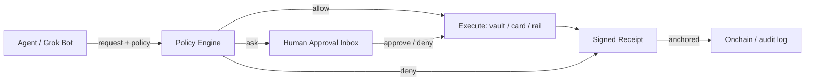

<div align="center">
  
  <h1>AskGrokWallet</h1>
  <p><strong>A governed wallet for Grok agents.</strong><br>Small things run. Big things ask. Everything receipts.</p>
  <p><em>agents run · humans rule · proof settles</em></p>
  <p>
    <a href="https://img.shields.io/badge/license-MIT-4f46e5"></a>
    <a href="https://img.shields.io/badge/version-0.1.0-38bdf8"></a>
    <a href="https://img.shields.io/badge/status-experimental-f59e0b"></a>
    <a href="https://img.shields.io/badge/for-Grok%20Bot-000000"></a>
    <a href="https://img.shields.io/badge/PRs-welcome-10b981"></a>
    <a href="https://github.com/askgrokwallet/askgrokwallet/actions/workflows/ci.yml"></a>
  </p>
</div>

AI agents can think, trade, and pay. AskGrokWallet is the layer that decides what they are **allowed** to do — inside human-defined rules, with a verifiable receipt for every outcome.

```text
agent request -> policy (allow / ask / deny) -> execute or approve -> signed receipt
```

> **Live demo:** [AskGrokWallet pitch](http://askgrokwallet.43.133.140.70.nip.io/pitch.html) · [open the approval inbox](http://askgrokwallet-demo.43.133.140.70.nip.io/approvals) ·
> **xAI marketplace PR:** [plugin-marketplace#341](https://github.com/xai-org/plugin-marketplace/pull/341)

---

## Why

Giving an agent a wallet is easy. Giving it a wallet with **rules** is not.

- Phantom, Stripe Link, Circle, and Kraken all give agents money — none of them decide what the agent may *do* with it.
- Ramp has an approval dashboard, but only inside Ramp's own card ecosystem.
- AskGrokWallet is the **cross-rail governance layer**: one plain-English policy, one approval inbox, one receipt format — in front of any wallet, any agent.

## Features

| # | Feature | What you get |
| --- | --- | --- |
| 01 | **Policy engine** | `payments under $50 run automatically; over $50 ask me; never pay blacklisted merchants; daily budget $200` → compiled `allow / ask / deny` rules |
| 02 | **Approval inbox** | Requests that need a human land in one inbox with full context; approve / deny in one tap |
| 03 | **Signed receipts** | Who, which agent, what, how much, who approved, when — every outcome leaves a receipt |
| 04 | **Budgets & allowlists** | Per-agent per-tx limits, daily budgets, counterparty allowlists, action allowlists |
| 05 | **Any rail** | Stripe Link, Ramp, Phantom, Circle USDC, Kraken, or the Boundless vault — same rules, swap rails freely |
| 06 | **Any agent** | Grok Bot, Cursor, Claude, Grok Build — one panel manages a whole roster |
| 07 | **Vault engine** | Funds locked in an onchain vault; leases grant bounded authority; the contract hard-blocks over-budget requests |
| 08 | **x402 ready** | Crypto rail support for conditional payments ("AI pays for itself", never silently) |

## Quickstart

### Install the plugin

```bash
# From GitHub (recommended — pinned SHA)
grok plugin install askgrokwallet/askgrokwallet --trust

# Or from a local path during development
grok plugin install ./integrations/grokbotwallet --trust
```

After install, the `askgrokwallet` skill appears in `/skills`. Enable it for a Bot via Settings → Plugins.

### Define a policy

Write plain English:

```text
payments under $50 run automatically; over $50 ask me;
never pay blacklisted merchants; daily budget $200
```

### Watch the loop

1. **Evaluate** — the policy engine returns `allow`, `ask`, or `deny`
2. **Ask** — `ask` requests create an approval:

   ```text
   POST /api/approvals
   { summary, amountUsd, requester, target, policyText }
   ```

3. **Decide** — approve or deny from the inbox:

   ```text
   POST /api/approvals/{id}
   { decision: "approve" | "deny", by: "operator" }
   ```

4. **Prove** — approved and blocked outcomes both produce a receipt.

## API reference

| Purpose | Method + URL |
| --- | --- |
| Compile + evaluate policy | `POST /api/approvals` (with `policyText`) |
| Create approval request | `POST /api/approvals` |
| List approvals | `GET /api/approvals?status=pending` |
| Decide approval | `POST /api/approvals/{id}` |
| Approval inbox (UI) | `GET /approvals` |

Write endpoints require a bearer token when `ASKWALLET_API_TOKEN` is configured.

## Architecture



The policy engine compiles plain-English rules into a structured policy (`autoBelowUsd`, `askAboveUsd`, `dailyBudgetUsd`, `denyKeywords`, `allowKeywords`). The approval store is pluggable: local file for development, KV for hosted deployments.

## Security

- The plugin **never** asks for private keys, passwords, or credentials
- Policy, budgets, and allowlists are always operator-defined; the skill never invents them
- Blocked actions return a reason and are **never** executed
- Receipts record who, what, how much, verdict, decision, and timestamps
- Marketplace packaging contains no `curl | bash`, remote code download/exec, or credential exfiltration patterns

See [SECURITY.md](https://github.com/askgrokwallet/.github/blob/main/SECURITY.md) for the vulnerability disclosure policy.

## Status & roadmap

- ✅ Policy engine + approval inbox + receipts — tested end-to-end (local + hosted)
- ✅ Boundless vault: lease, budgets, real transfers, onchain receipts — verified on a local chain
- ✅ Marketplace packaging for Grok Build + Cursor
- ⏳ Hosted persistent storage (KV/Blob)
- ⏳ Testnet / mainnet deployment
- ⏳ x402 payment rail

## Contributing

See [CONTRIBUTING.md](https://github.com/askgrokwallet/.github/blob/main/CONTRIBUTING.md). One logical change per PR, keep the diff minimal, no secrets.

## License

MIT © 2026 AskGrokWallet
